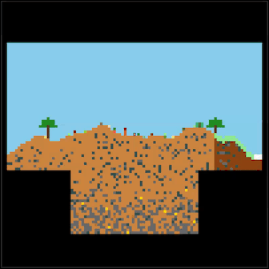

# [Sprite Garden](https://kherrick.github.io/sprite-garden/)

Sprite Garden is a 2D sandbox exploration and farming game. Explore procedurally generated worlds, discover different biomes, mine resources, and cultivate a variety of crops.


[](https://kherrick.github.io/sprite-garden/)

## Features

- Procedural World Generation - Each world is unique, generated from a shareable seed
- Multiple Biomes - Explore forests, deserts, tundras, and swamps, each with unique characteristics
- Farming System - Plant and harvest different crop types with realistic growth cycles
- Resource Mining - Dig for valuable resources like coal, iron, and gold
- Cave Systems - Discover underground caves filled with resources and challenges
- Building - Use collected materials to place blocks and shape the world
- Clouds -  Continue building and farming while in the sky
- Save & Load - Your progress can be saved on device or as a file to share

## Controls

```
Movement: W/A/S/D or Arrow Keys
Jump: W, ↑, or Space
Plant/Harvest: F
Break Block: R
Change Break Mode: E
Change Movement Scale: X
Change Block Range: K
Place Block: U/I/O/J/L/M/,/.
World State Menu: Ctrl+S
Inspect Tiles: Mouse hover
Tap the bottom corner panel for mobile controls.
```

[](https://kherrick.github.io/sprite-garden/)


## Tips for New Players

- Start by exploring your immediate surroundings to understand the biome
- Harvest natural crops to build up your seed inventory
- Look for farmable ground (dirt, grass, clay, sand) to plant seeds
- Different crops grow at different rates - mushrooms are fastest, trees are slowest
- Mine resources by breaking blocks (R key) - you'll collect materials automatically
- Fog clears as exploration progresses
- Save your game frequently using the World State menu (Ctrl+S)
- Share interesting worlds with friends!

## To play locally

```sh
npm i && npm start
```

## To run Jest unit tests

```sh
npm i && npm test
```

## to run Playwright e2e tests

```sh
npm i && npm e2e
```
